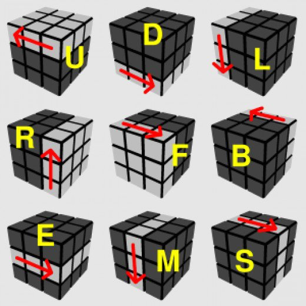

# Rubik's cube

[](https://travis-ci.org/Rubenmp/Rubik)

This program solves Rubik's cube 3x3.


## Introduction
Rubik's cube will be read from file or keyboard, it's represented as plain text.
The standard position for our Rubik's cube is: green side in front of you and white side up, we will need this to recognize movements.


## Usage
Here <input_file> represents a Rubik's cube which we want to solve, <output_file> is the optional file to send the solution.

``` bash
$ ./Rubik [option] [<input_file> [<output_file>]]
```


| Option | Description |
|----|--
| -e | explanation of valid <input_file> (same format for <output_file>) |
| -h | print this help and exit |
| -i | interactive mode of resolution, without extra arguments |
|-MX| execute movement X in {U,u,D,d,L,l,R,r,F,f,B,b} to cube <input_file> (modified) |
| -m | explain valid movements |
| -p | print cube in human-readable format, need <input_file> |
| -r | random Rubik's cube solution |
| -R | generate a random Rubik's cube |
| -s | show if a Rubik's cube is solved (y[es]/n[o]), need <input_file> |


## Colors
You can use three different options (simultaneously is possible, not recommended):
   W/w/1 for white
   O/o/2 for orange
   G/g/3 for green
   R/r/4 for red
   L/l/5 for blue
   Y/y/6 for yellow

The program will read 54 colors, one side each time.
You will be able to change the colors if you made mistakes. The program represents Rubik's cube in two dimensions with green side in front of user (centered blue sticker represents blue side):


It would be represented in a file as
```
w w w w w w w w w
o o o o o o o o o
g g g g g g g g g
r r r r r r r r r
l l l l l l l l l
y y y y y y y y y
```

### Other colors
If your rubik's cube has different patterns or colors, look at this:

-Example 1: If the center of the left side is red, in all stickers you should select orange.

-Example 2: If the center of the back side is black, in your black stickers you should select blue.


## Movements
The Rubik's cube has 12 main movements and 6 double movements: F2, B2, R2, L2, U2, D2. "FBRLUD" movements in clockwise and "fbrlud" the opposite movement. As you can see [here](https://hobbylark.com/puzzles/Rubik-Cube-Algorithms):

    F(ront) B(ack) R(igth) L(eft) U(p) D(own)




## Future work
Ordered by difficulty:

* -t option to show tricks for pretty patterns

* -l <input_file> option to show logic errors in a Rubik's cube (like invalid permutations that made the cube unresolvable) and how to solve it [self implemented]

* Implement advanced methods as Fridrich in 3x3

* Solve 4x4, 5x5, [megamix](https://www.flipkart.com/shengshou-megamix/p/itmdrbgnevm7yhsd), who knows...

For any doubt or suggestion you can [contact me](https://github.com/Rubenmp) or [create an issue](https://github.com/Rubenmp/Rubik/issues) respectively.
