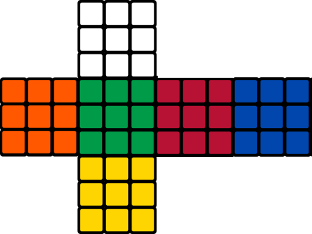
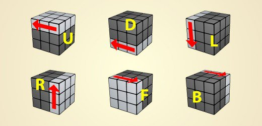

# Rubik's cube

This program solves Rubik's cube 3x3 with Beginners Method.

## Introduction
The rubik's cube will be read from file or keyboard.
The standard position for the rubik's cube is: green side in front of you and white side up.
If your rubik's cube has different patterns or colours, look at this:

-Example 1: If the center of the left side is red, in all stickers you should select orange.

-Example 2: If the center of the back side is black, in your black stickers you should select blue.

The program will read 54 colours, one side each time.


## Usage
``` bash
$ ./Rubik [option] [<input_file> [<output_file>]]
```
<input_file> represents a Rubik's cube which we want to solve, <output_file> is the optional file to send the solution.


| Option | Description |
|----|--
| -e | explanation of valid <input_file> (same format for <output_file>) |
| -h | print this help and exit |
| -i | interactive mode of resolution, without extra arguments |
|-M<m>| execute movement <m>(in {U,u,D,d,L,l,R,r,F,f,B,b}) to cube in <input_file> (it's modified) |
| -m | explain valid movements |
| -p | print cube in human-readable format, need <input_file> |
| -R | random Rubik's cube solution |
| -r | generate a random Rubik's cube |
| -s | show if a Rubik's cube is solved (y[es]/n[o]), need <input_file> |


## Colours
You can use three different options (simultaneously is possible, not recommended):
   W/w/1 for white
   O/o/2 for orange
   G/g/3 for green
   R/r/4 for red
   L/l/5 for blue
   Y/y/6 for yellow

You will be able to change the colours if you made mistakes. The program represents Rubik's cube in two dimensions with green side in front of user (centered blue sticker represents that the colour of the side is blue):



It would be represented in a file as
``` bash
w w w w w w w w w
o o o o o o o o o
g g g g g g g g g
r r r r r r r r r
l l l l l l l l l
y y y y y y y y y

```


## Movements
The Rubik's cube has 12 different movements and double movements: F2, B2, R2, L2, U2, D2. "FBRLUD" movements in clockwise and "fbrlud" the opposite movement. As you can see [here](https://hobbylark.com/puzzles/Rubik-Cube-Algorithms):

    F(ront) B(ack) R(igth) L(eft) U(p) D(own)


